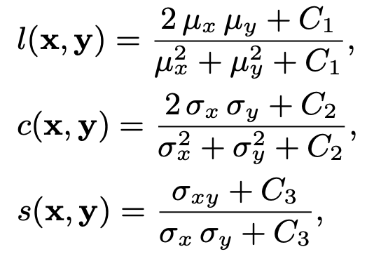
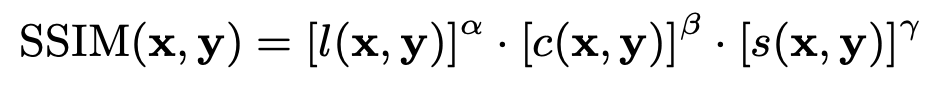
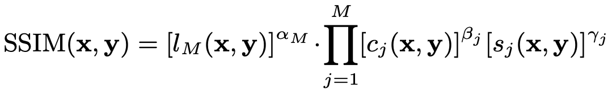
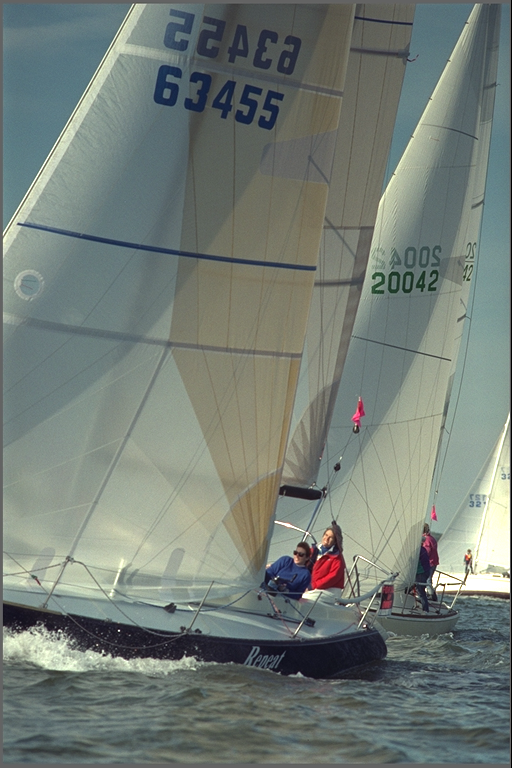
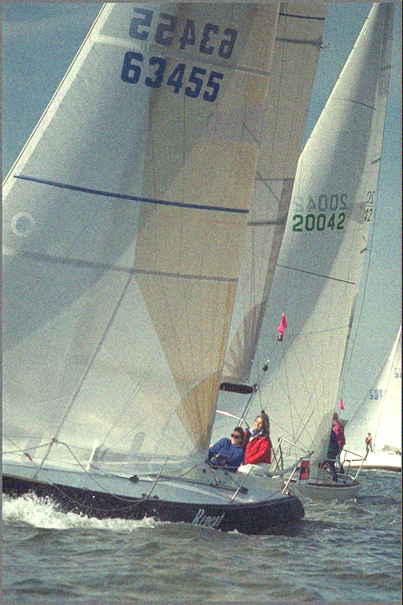
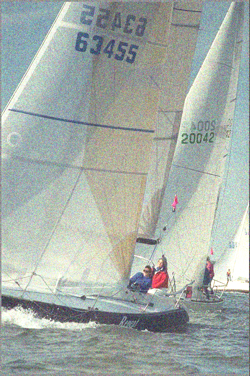
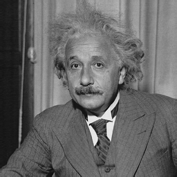
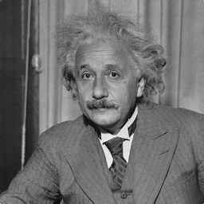

# Paddle MS-SSIM

## Introduction
* Fast and differentiable MS-SSIM and SSIM for Paddle.

    

* Structural Similarity (SSIM): 

    

* Multi-Scale Structural Similarity (MS-SSIM):

    

## Installation
* via pip

    ```bash
    $ pip install paddle-msssim
    ```

* via sources

    ```bash
    $ git clone https://github.com/AgentMaker/Paddle-MSSSIM

    $ cd Paddle-MSSSIM

    $ python setup.py install
    ```

## Usage

* Basic Usage 

    ```python
    from paddle_msssim import ssim, ms_ssim, SSIM, MS_SSIM
    # X: (N,3,H,W) a batch of non-negative RGB images (0~255)
    # Y: (N,3,H,W)  

    # calculate ssim & ms-ssim for each image
    ssim_val = ssim( X, Y, data_range=255, size_average=False) # return (N,)
    ms_ssim_val = ms_ssim( X, Y, data_range=255, size_average=False ) #(N,)

    # set 'size_average=True' to get a scalar value as loss. see tests/tests_loss.py for more details
    ssim_loss = 1 - ssim( X, Y, data_range=255, size_average=True) # return a scalar
    ms_ssim_loss = 1 - ms_ssim( X, Y, data_range=255, size_average=True )

    # reuse the gaussian kernel with SSIM & MS_SSIM. 
    ssim_module = SSIM(data_range=255, size_average=True, channel=3) # channel=1 for grayscale images
    ms_ssim_module = MS_SSIM(data_range=255, size_average=True, channel=3)

    ssim_loss = 1 - ssim_module(X, Y)
    ms_ssim_loss = 1 - ms_ssim_module(X, Y)
    ```

* Normalized input

    ```python
    '''
    If you need to calculate MS-SSIM/SSIM on normalized images
    Please denormalize them to the range of [0, 1] or [0, 255] first
    '''
    # X: (N,3,H,W) a batch of normalized images (-1 ~ 1)
    # Y: (N,3,H,W)  
    X = (X + 1) / 2  # [-1, 1] => [0, 1]
    Y = (Y + 1) / 2  
    ms_ssim_val = ms_ssim( X, Y, data_range=1, size_average=False ) #(N,)
    ```

* Enable nonnegative_ssim

    * For ssim, it is recommended to set `nonnegative_ssim=True` to avoid negative results. However, this option is set to `False` by default to keep it consistent with tensorflow and skimage.

    * For ms-ssim, there is no nonnegative_ssim option and the ssim reponses is forced to be non-negative to avoid NaN results.

## Test
* Switch to the tests dir

    ```bash
    $ cd ./tests
    ```

* Benchmark

    ```bash 
    $ python comparisons_skimage_tf_torch.py
    ```

        outputs(AMD Ryzen 4600H): 

        ===================================
                    Test SSIM
        ===================================
        ====> Single Image
        Repeat 10 times
        sigma=0.0 ssim_skimage=1.000000 (247.7732 ms), ssim_tf=1.000000 (277.2696 ms), ssim_paddle=1.000000 (179.4677 ms), ssim_torch=1.000000 (183.6994 ms)
        sigma=10.0 ssim_skimage=0.932399 (226.1620 ms), ssim_tf=0.932640 (257.2435 ms), ssim_paddle=0.932636 (163.2263 ms), ssim_torch=0.932400 (179.1418 ms)
        sigma=20.0 ssim_skimage=0.786023 (224.1826 ms), ssim_tf=0.786032 (279.2126 ms), ssim_paddle=0.786017 (158.3070 ms), ssim_torch=0.786027 (180.0890 ms)
        sigma=30.0 ssim_skimage=0.637174 (237.5582 ms), ssim_tf=0.637183 (267.6092 ms), ssim_paddle=0.637165 (167.9277 ms), ssim_torch=0.637178 (181.7910 ms)
        sigma=40.0 ssim_skimage=0.515865 (221.0388 ms), ssim_tf=0.515876 (264.3230 ms), ssim_paddle=0.515857 (170.7676 ms), ssim_torch=0.515869 (189.0941 ms)
        sigma=50.0 ssim_skimage=0.422551 (222.6846 ms), ssim_tf=0.422558 (273.1971 ms), ssim_paddle=0.422542 (168.3579 ms), ssim_torch=0.422554 (176.7442 ms)
        sigma=60.0 ssim_skimage=0.351337 (215.1536 ms), ssim_tf=0.351340 (270.5560 ms), ssim_paddle=0.351325 (164.3315 ms), ssim_torch=0.351340 (194.6781 ms)
        sigma=70.0 ssim_skimage=0.295752 (210.0273 ms), ssim_tf=0.295756 (272.1814 ms), ssim_paddle=0.295744 (169.3864 ms), ssim_torch=0.295755 (178.9230 ms)
        sigma=80.0 ssim_skimage=0.253164 (239.2978 ms), ssim_tf=0.253169 (260.8894 ms), ssim_paddle=0.253157 (184.7061 ms), ssim_torch=0.253166 (181.4640 ms)
        sigma=90.0 ssim_skimage=0.219240 (224.7329 ms), ssim_tf=0.219245 (270.3727 ms), ssim_paddle=0.219235 (172.3580 ms), ssim_torch=0.219242 (180.5838 ms)
        sigma=100.0 ssim_skimage=0.192630 (238.8582 ms), ssim_tf=0.192634 (261.4317 ms), ssim_paddle=0.192624 (166.0294 ms), ssim_torch=0.192632 (175.7241 ms)
        Pass!
        ====> Batch
        Pass!


        ===================================
                    Test MS-SSIM
        ===================================
        ====> Single Image
        Repeat 10 times
        sigma=0.0 msssim_tf=1.000000 (534.9398 ms), msssim_paddle=1.000000 (231.7381 ms), msssim_torch=1.000000 (257.3238 ms)
        sigma=10.0 msssim_tf=0.991148 (525.1758 ms), msssim_paddle=0.991147 (213.8527 ms), msssim_torch=0.991101 (243.9299 ms)
        sigma=20.0 msssim_tf=0.967450 (523.3070 ms), msssim_paddle=0.967447 (217.2415 ms), msssim_torch=0.967441 (253.1073 ms)
        sigma=30.0 msssim_tf=0.934692 (538.5145 ms), msssim_paddle=0.934687 (215.2203 ms), msssim_torch=0.934692 (242.5429 ms)
        sigma=40.0 msssim_tf=0.897363 (558.0346 ms), msssim_paddle=0.897357 (219.1107 ms), msssim_torch=0.897362 (249.1027 ms)
        sigma=50.0 msssim_tf=0.859276 (524.8582 ms), msssim_paddle=0.859267 (232.4189 ms), msssim_torch=0.859275 (263.1328 ms)
        sigma=60.0 msssim_tf=0.820967 (512.8726 ms), msssim_paddle=0.820958 (223.7422 ms), msssim_torch=0.820965 (251.9713 ms)
        sigma=70.0 msssim_tf=0.784204 (529.6149 ms), msssim_paddle=0.784194 (213.1742 ms), msssim_torch=0.784203 (244.9676 ms)
        sigma=80.0 msssim_tf=0.748574 (545.3014 ms), msssim_paddle=0.748563 (222.8581 ms), msssim_torch=0.748572 (261.0413 ms)
        sigma=90.0 msssim_tf=0.715980 (538.3886 ms), msssim_paddle=0.715968 (214.4464 ms), msssim_torch=0.715977 (282.6247 ms)
        sigma=100.0 msssim_tf=0.683882 (540.9150 ms), msssim_paddle=0.683870 (218.5596 ms), msssim_torch=0.683880 (244.1856 ms)
        Pass
        ====> Batch
        Pass

## Example
* Image comparison

    |SSIM = 1.0000|SSIM = 0.4225|SSIM = 0.1924|
    |:-:|:-:|:-:|
    | |||

* As a loss function

    * switch to the examples/as_loss dir

        ```bash
        $ cd ./examples/as_loss
        ```
    
    * run the example script 'as_loss.py'

        ```bash
        $ python as_loss.py
        ```

            Initial ssim: 0.9937540888786316
            step: 1 ssim_loss: 0.993843
            step: 2 ssim_loss: 0.993934
            step: 3 ssim_loss: 0.994021
            step: 4 ssim_loss: 0.994106
            step: 5 ssim_loss: 0.994190
            ...
            step: 81 ssim_loss: 0.999762
            step: 82 ssim_loss: 0.999785
            step: 83 ssim_loss: 0.999862
            step: 84 ssim_loss: 0.999874
            step: 85 ssim_loss: 0.999884
            step: 86 ssim_loss: 0.999892
            step: 87 ssim_loss: 0.999912

    * result

        |Input|Output|
        |:-:|:-:|
        | ||

    * See ['examples/as_loss/as_loss.py'](./examples/as_loss/as_loss.py) for more details

## References
 
* [SSIM Research](https://ece.uwaterloo.ca/~z70wang/research/ssim/) 

* [MS-SSIM Paper](https://ece.uwaterloo.ca/~z70wang/publications/msssim.pdf)  

* [Matlab Code](https://ece.uwaterloo.ca/~z70wang/research/iwssim/)   

* [Pytorch Code](https://github.com/VainF/pytorch-msssim) 

* [TensorFlow Code](https://github.com/tensorflow/tensorflow/blob/v2.1.0/tensorflow/python/ops/image_ops_impl.py#L3314-L3438) 

## Thanks
* This repo is based on [Pytorch MS-SSIM](https://github.com/VainF/pytorch-msssim) developed by [@VainF](https://github.com/VainF).

* Thanks to this project and its developers.